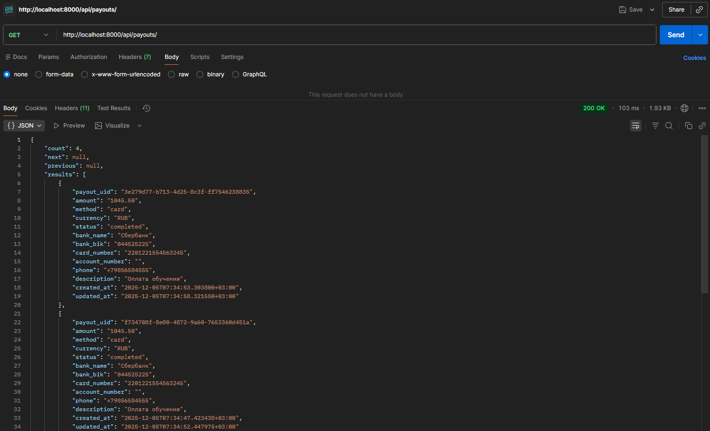
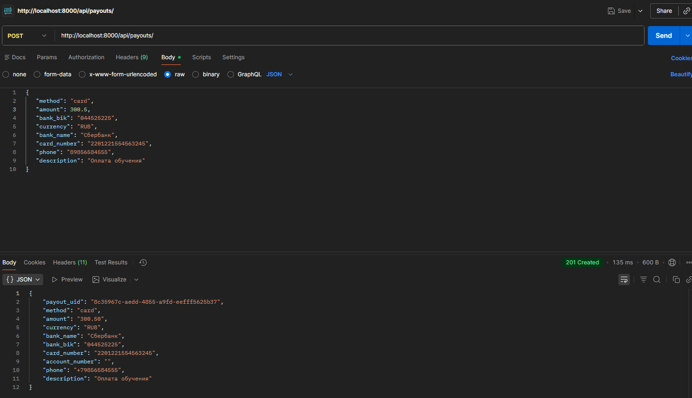
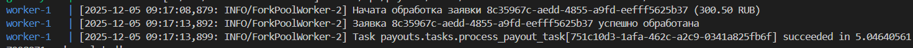
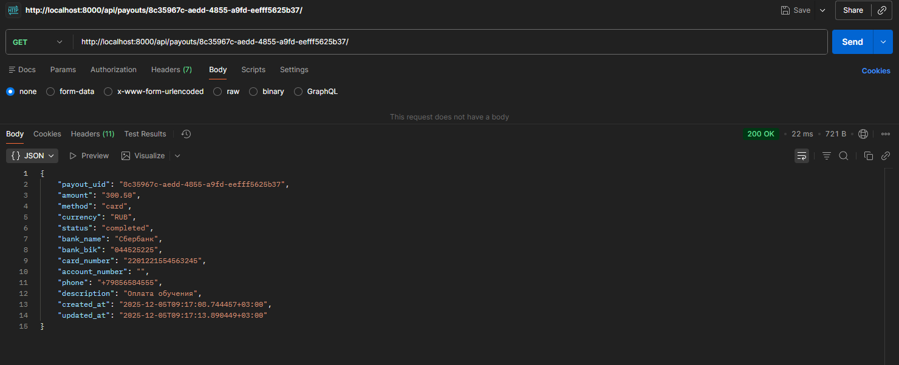
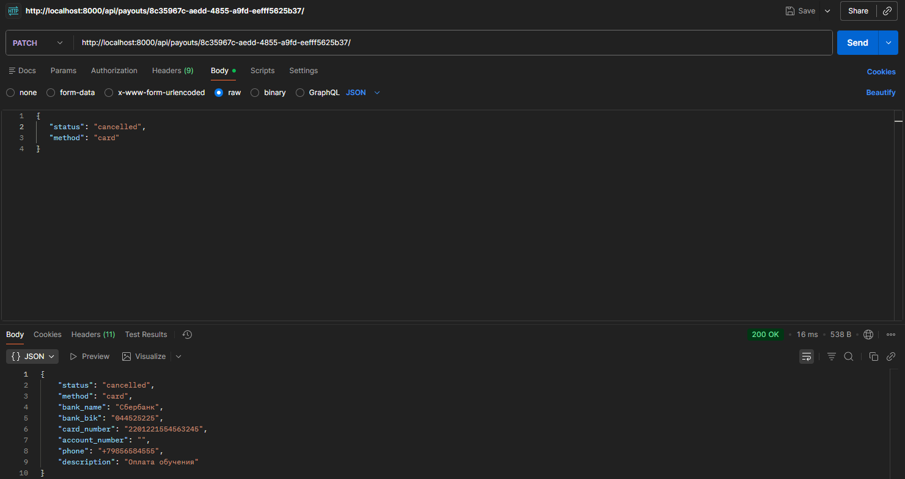
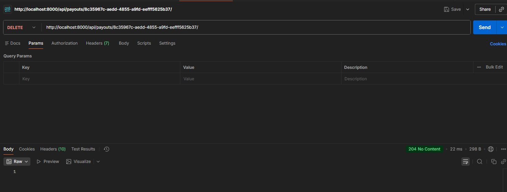
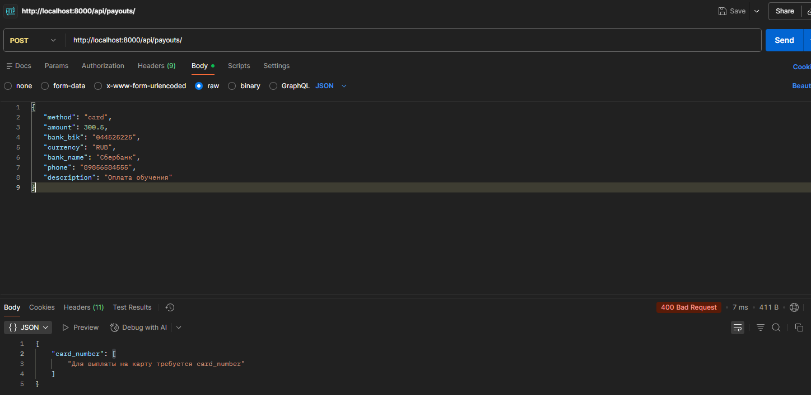

# smart_collect_task
Небольшой REST-сервис для управления заявками на выплату средств
1) Как я представляю деплой проекта в прод:
```
Проект разворачивается в продакшене в контейнеризованной среде (Docker), где каждый компонент работает в отдельном сервисе.
Развертывания происходит через CI/CD (GitHub Actions / GitLab CI), который:
  1. Обновляет Docker-образы из Docker Hub
  2. Прогоняет тесты
  3. Деплоит на сервер
Django работает на Gunicorn -> Nginx (обратный прокси)
Celery запускается как отдельный воркер
Все секреты (ключи пароли, DNS) хранятся в переменных окружения.
```
2) Необходимые сервисы:
```ini
1. Django + Gunicorn # Основное приложение
2. Nginx # Reverse Proxy, SSL, статика
3. PostgreSQL # Основная БД
4. Redis # Брокер задач
5. Celery # worker Обработка асинхронных задач
```
3) Как запускал бы Django и Celery в реальной системе
```
В продакшене проект запускался бы через отдельны docker-compose.production.yml, который содержал бы все сервисы.
Пример запуска Django в контейнере:
CMD ["gunicorn", "--bind", "0.0.0.0:8000", "foodgram.wsgi"]
Пример запуска Celery:
celery -A celery_app worker -l info
```
4) Минимальные шаги подготовки окружения:
```
1. Создать файл .env по примеру .env_example
2. Запустить сервисы: docker compose up --build
3. Запустить миграции: docker compose exec backend python manage.py migrate
4.Собрать статику: docker compose exec backend python manage.py collectstatic
5. Копировать статику: docker compose exec backend cp -r /app/collected_static/. /backend_static/static/
```

## Стек технологий


## Установка

### Клонирование репозитория

```bash
git clone https://github.com/WarfoIomey/smart_collect_task.git
cd smart_collect_task
```

## Структура проекта

- `backend/` — основное приложение Django REST Framework.
  - `tests/` — тесты для приложения Django
  - `api/` — реализация API на основе Django REST Framework.
  - `payouts/` — приложение для работы с выплатами.

## API Endpoints (Схема)

Базовый URL: `/api/`
```bash
/api/
├── payouts/
  ├── GET /payouts/ — список заявок
  ├── GET /payouts/{id}/ — получение заявки по идентификатору
  ├── POST /payouts/ — создание новой заявки
  ├── PATCH /payouts/{id}/ — частичное обновление заявки
  └── DELETE /payouts/{id}/ — удаление заявки

```


## Развёртывание на сервер

Выполните следующие команды:
```bash
docker compose up --build
docker compose exec backend python manage.py migrate
docker compose exec backend python manage.py collectstatic
docker compose exec backend cp -r /app/collected_static/. /backend_static/static/
```
Для создания суперпользователя выполните следующую команду:
```bash
    docker compose exec backend python manage.py createsuperuser
```

После успешного выполнения этих команд приложение будет доступно по адресу <http://localhost:8000/>.

## Настройки окружения

Перед запуском приложения настройте переменные окружения (пример в файле .env_example):

- `POSTGRES_USER`— пользователь базы данных.
- `POSTGRES_PASSWORD`— пароль пользователя базы данных.
- `POSTGRES_DB`— имя базы данных PostgreSQL.
- `SECRET_KEY` — секретный ключ Django.
- `DB_HOST` — хост базы данных.
- `DB_PORT` — порт для подключения к базе данных.
- `ALLOWED_HOSTS` — список доступных хостов.
- `DEBUG` — статус отладки Django.

## Запуск тестов

Для запуска тестов настройте переменные окружения (пример в файле .env_test_example)

Перейдите в папку

```bash
cd backend
```
И введите команду

```bash
pytest
```

## Запуск проекта с помощью Makefile

Список команд Makefile
```bash
make help
```
Для запуска проекта выполните команды
```bash
make up
make migrate
make collectstatic
```


## Скриншоты Postman









## Документация API

Чтобы получить документацию SWAGGER или REDOC
```
http://localhost:8000/redoc/ 
http://localhost:8000/swagger/
```